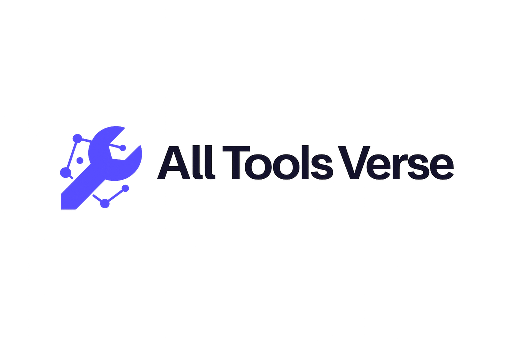

<p align="center">
  <a href="https://alltoolsverse.com/">
    <picture>
      <source media="(prefers-color-scheme: dark)" srcset="assets/all-tools-verse-logo-dark.png">
      <source media="(prefers-color-scheme: light)" srcset="assets/all-tools-verse-logo.png">
      
    </picture>
  </a>
</p>

<h1 align="center">All Tools Verse</h1>

<p align="center">
  <strong>1,000+ free, privacy-first browser tools. No signup required.</strong>
</p>

<p align="center">
  <a href="https://alltoolsverse.com/">Website</a> ·
  <a href="https://alltoolsverse.com/tools/">Browse all tools</a> ·
  <a href="catalog/README.md">Category directory</a> ·
  <a href="CONTRIBUTING.md">Contribute</a>
</p>

All Tools Verse is a searchable library of browser-based utilities for images, documents, development, text, data, conversions, calculations and everyday tasks. This repository is the public directory for the library, not the source code of the website.

For client-side tools, your inputs stay in your browser. A specific tool may use server processing only when that behavior is clearly required and disclosed on its page.

<!-- CATALOG_STATS:START -->
**1,003 canonical live tools across 23 categories** · Catalog refreshed 2026-07-18
<!-- CATALOG_STATS:END -->

## Explore by category

<!-- CATEGORIES:START -->
| Category | Tools | Live category |
|---|---:|---|
| [ASCII](catalog/ascii.md) | 29 | [Open](https://alltoolsverse.com/tool-category/ascii/) |
| [Binary](catalog/binary.md) | 43 | [Open](https://alltoolsverse.com/tool-category/binary/) |
| [Conversion](catalog/conversion.md) | 15 | [Open](https://alltoolsverse.com/tool-category/conversion/) |
| [CSV](catalog/csv.md) | 26 | [Open](https://alltoolsverse.com/tool-category/csv/) |
| [Developer](catalog/developer.md) | 94 | [Open](https://alltoolsverse.com/tool-category/developer/) |
| [Document](catalog/document.md) | 51 | [Open](https://alltoolsverse.com/tool-category/document/) |
| [Financial](catalog/financial.md) | 10 | [Open](https://alltoolsverse.com/tool-category/financial/) |
| [Fractals](catalog/fractals.md) | 29 | [Open](https://alltoolsverse.com/tool-category/fractals/) |
| [Generators](catalog/generators.md) | 36 | [Open](https://alltoolsverse.com/tool-category/generators/) |
| [Health](catalog/health.md) | 5 | [Open](https://alltoolsverse.com/tool-category/health/) |
| [Hex](catalog/hex.md) | 36 | [Open](https://alltoolsverse.com/tool-category/hex/) |
| [Image](catalog/image.md) | 139 | [Open](https://alltoolsverse.com/tool-category/image/) |
| [JSON](catalog/json.md) | 24 | [Open](https://alltoolsverse.com/tool-category/json/) |
| [Marketing](catalog/marketing.md) | 14 | [Open](https://alltoolsverse.com/tool-category/marketing/) |
| [Math](catalog/math.md) | 45 | [Open](https://alltoolsverse.com/tool-category/math/) |
| [Number](catalog/number.md) | 84 | [Open](https://alltoolsverse.com/tool-category/number/) |
| [Security](catalog/security.md) | 15 | [Open](https://alltoolsverse.com/tool-category/security/) |
| [SEO](catalog/seo.md) | 28 | [Open](https://alltoolsverse.com/tool-category/seo/) |
| [Text](catalog/text.md) | 84 | [Open](https://alltoolsverse.com/tool-category/text/) |
| [Time & Date](catalog/time.md) | 95 | [Open](https://alltoolsverse.com/tool-category/time/) |
| [Unicode](catalog/unicode.md) | 42 | [Open](https://alltoolsverse.com/tool-category/unicode/) |
| [UTF-8](catalog/utf8.md) | 31 | [Open](https://alltoolsverse.com/tool-category/utf8/) |
| [WebP](catalog/webp.md) | 28 | [Open](https://alltoolsverse.com/tool-category/webp/) |
<!-- CATEGORIES:END -->

## Catalog data

The repository includes two machine-readable versions of the canonical tool inventory:

- [`data/tools.json`](data/tools.json): structured tool records with IDs, URLs, categories and modification dates.
- [`data/tools.csv`](data/tools.csv): spreadsheet-friendly export.
- [`data/categories.json`](data/categories.json): the current public taxonomy and category counts.

Tools can belong to more than one category. They appear once in the data inventory and in every relevant category directory.

## Keep the directory current

The catalog is generated from the public WordPress REST API and filtered against the canonical tool URLs published in the XML sitemap.

```bash
npm run sync
npm run validate
```

The first command refreshes the generated catalog and data files. The second validates counts, duplicate URLs and slugs, category references, generated Markdown and repository wording.

Generated files should not be edited manually. See [CONTRIBUTING.md](CONTRIBUTING.md) for the correct workflow.

## Suggest a tool or report a problem

- [Report a broken link or incorrect listing](../../issues/new?template=broken-link.yml)
- [Suggest a useful tool for the All Tools Verse library](../../issues/new?template=tool-suggestion.yml)
- For sensitive security reports, follow [SECURITY.md](SECURITY.md).

This repository does not accept paid placement, backlink exchanges or unrelated third-party directory submissions.

## License and trademarks

The catalog data, generated directory content, documentation and repository scripts are dedicated to the public domain under [CC0 1.0](LICENSE). All Tools Verse names, logos and brand assets are excluded from that dedication; see [NOTICE.md](NOTICE.md) and [`assets/README.md`](assets/README.md).

---

Built and maintained by [All Tools Verse](https://alltoolsverse.com/) · [@alltoolsverse](https://x.com/alltoolsverse)
